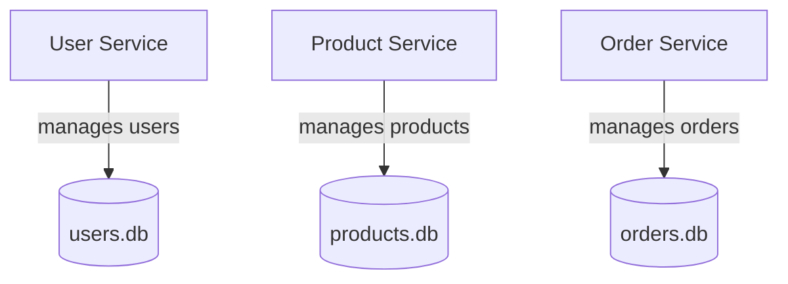

# 🧩 Microservices Demo (.NET + SQLite)

This project is a **learning-oriented microservices architecture** built with **ASP.NET Core Web API** and **Entity Framework Core (SQLite)**. It guides you through the evolution of a microservice landscape by incrementally introducing communication patterns, messaging, observability, and containerization.

---

## 🧭 Table of Contents

1. [Concepts & Technologies](#-concepts--technologies)
2. [Solution Overview](#-solution-overview)
3. [Prerequisites](#-prerequisites)
4. [Getting Started](#-getting-started)
5. [Running the Services](#-running-the-services)
6. [RabbitMQ & MassTransit](#-rabbitmq--masstransit)
7. [Service Endpoints](#-service-endpoints)
8. [Architecture Evolution](#-architecture-evolution)
9. [Quick Test Flow](#-quick-test-flow)
10. [Learning Goals](#-learning-goals)

---

## 🧠 Concepts & Technologies

| Technology | Purpose in the project |
|------------|-----------------------|
| **ASP.NET Core Web API** | Hosts each microservice as a lightweight HTTP API with independent lifecycle and deployment. |
| **Entity Framework Core (EF Core)** | Provides an ORM layer for database access, enabling migrations, LINQ queries, and unit-of-work patterns per service. |
| **SQLite** | Supplies an embedded, file-based database that keeps each microservice’s data isolated while remaining simple to run locally. |
| **RabbitMQ** | Acts as the message broker so services can communicate asynchronously and remain decoupled. |
| **MassTransit** | Offers a .NET abstraction over RabbitMQ, handling message contracts, routing, and consumer lifecycles with minimal boilerplate. |
| **Polly** | Adds resilience policies (retry, circuit breaker, timeout) around outbound HTTP calls to other services. |
| **SignalR** | Powers real-time updates from the EventHub service to the Angular UI by broadcasting domain events over WebSockets. |
| **Angular** | Represents the SPA frontend that consumes REST endpoints and listens to EventHub notifications. |
| **Serilog** | Delivers structured logging to rolling files and exposes log inspection endpoints for troubleshooting. |
| **Docker Compose** | Orchestrates all services, the RabbitMQ broker, and persistent volumes for local development with one command. |

### Microservices in Plain Terms

- A **microservice** is a small, independent application that does *one thing well*.
- Each service:
  - Has its own codebase
  - Runs independently
  - Owns its own database
  - Talks to others via APIs or messages

#### Monolith vs Microservices

| Monolith 🏛 | Microservices 🧩 |
|-------------|-----------------|
| Single codebase, tightly coupled | Many small, independent services |
| One shared database | One database per service |
| Easy to start, harder to scale | More complex, but scalable & resilient |

---

## 🏗️ Solution Overview

We simulate a **mini e-commerce system** with four services:

- **User Service** → manages users (`users.db`)
- **Product Service** → manages products (`products.db`)
- **Order Service** → manages orders (`orders.db`), validates users and products
- **EventHub Service** → listens to RabbitMQ events and streams them to the UI via SignalR

```
MicroservicesDemo.sln
├── UserService/          # Manages users
├── ProductService/       # Manages products
├── OrderService/         # Manages orders
└── EventHubService/      # SignalR hub that replays domain events for the UI
```

Each service is:
- An **ASP.NET Core Web API**
- Uses **EF Core + SQLite**
- Has its own **database file**
- Runs on its own port

---

## ⚒️ Prerequisites

- [.NET SDK 8+](https://dotnet.microsoft.com/download)
- [Node.js 18+](https://nodejs.org/) (for running the Angular frontend in `frontend/`)
- [Docker Desktop](https://www.docker.com/products/docker-desktop/) or Docker Engine if you plan to use Docker Compose
- Optional but recommended: [HTTP client](https://www.postman.com/) such as Postman or VS Code REST Client to exercise the APIs

---

## 🚀 Getting Started

1. **Clone the repository**
   ```bash
   git clone https://github.com/<your-account>/Light-Microservices.git
   cd Light-Microservices
   ```
2. **Restore dependencies**
   ```bash
   dotnet restore MicroservicesDemo.sln
   ```
3. **Apply database migrations** (optional – the services create SQLite databases on first run, but you can apply migrations explicitly)
   ```bash
   dotnet ef database update --project UserService
   dotnet ef database update --project ProductService
   dotnet ef database update --project OrderService
   ```
4. **Start the Angular frontend (optional)**
   ```bash
   cd frontend
   npm install
   npm start
   ```

---

## ⚙️ Running the Services

Open a terminal for each service and run:

```bash
# User Service (http://localhost:5001)
cd UserService
dotnet run

# Product Service (http://localhost:5003)
cd ProductService
dotnet run

# Order Service (http://localhost:5005)
cd OrderService
dotnet run

# EventHub Service (http://localhost:5007)
cd EventHubService
dotnet run
```

> ℹ️ Each project uses its own `appsettings.Development.json` to configure SQLite connection strings, RabbitMQ endpoints, and logging.

### 🐳 Running with Docker Compose

To start all services together with persistent SQLite databases, use Docker Compose from the project root:

```bash
docker compose up --build
```

- Database files are stored on the host inside the `data/` directory (one subfolder per service), so they survive container restarts.
- The EventHub service is available at `http://localhost:5007` and exposes the SignalR hub at `/hub/notifications` for Angular clients.
- **RabbitMQ Dashboard** — Once Compose is running, open http://localhost:15672 (default user/password: `guest`/`guest`) to inspect queues, messages, and consumers that MassTransit creates.

---

## 🐇 RabbitMQ & MassTransit

- Docker Compose spins up a dedicated `rabbitmq:3-management` container alongside the APIs.
- `UserService` emits a `UserCreatedEvent` whenever a new profile is stored.
- `OrderService` publishes either `OrderCreatedEvent` (success) or `OrderFailedEvent` (e.g., insufficient stock) to orchestrate downstream workflows.
- `ProductService` listens for `OrderCreatedEvent`, applies **idempotent** stock updates, and emits a `StockDecreasedEvent` once the inventory change succeeds.
- Connection settings can be overridden via `RabbitMq__*` environment variables (see each service’s `appsettings.Development.json` for local defaults).

### 🐳 Running only RabbitMQ & MassTransit

```bash
docker compose up rabbitmq -d
```
---

## 🔎 Service Endpoints

### 👤 User Service
- `GET /api/users` → list users
- `GET /api/users/{id}` → get user by ID
- `POST /api/users` → create a user
- `PUT /api/users/{id}` → update name/email
- `DELETE /api/users/{id}` → remove a user
- `GET /api/logs/{level}` → inspect `logs/{level}.log` (`info`, `warning`, `error`)

Example request:
```json
{ "name": "Alice", "email": "alice@example.com" }
```

### 📦 Product Service
- `GET /api/products` → list products
- `GET /api/products/{id}` → get product by ID
- `POST /api/products` → create a product
- `PUT /api/products/{id}` → update product details
- `DELETE /api/products/{id}` → remove a product
- `GET /api/logs/{level}` → inspect `logs/{level}.log`

Example request:
```json
{ "name": "Laptop", "price": 1200.00, "stock": 5 }
```

### 📝 Order Service
- `GET /api/orders` → list the most recent orders
- `GET /api/orders/{id}` → get order by ID
- `POST /api/orders` → create a new order
- `GET /api/logs/{level}` → inspect `logs/{level}.log`

Example request:
```json
{ "userId": "GUID", "productId": "GUID", "quantity": 2 }
```

### 🔔 EventHub Service
- `SignalR hub` → connect clients to `/hub/notifications`
- Broadcasts: `OrderCreated`, `StockDecreased`, `OrderFailed`, `UserCreated`
- `GET /api/logs/{level}` → inspect `logs/{level}.log`

Orders are created synchronously over HTTP. After persistence the service publishes an `OrderCreatedEvent`, which triggers Product Service to adjust inventory.

---

## 🧱 Architecture Evolution

### 📊 Step 1: Independent Services



### 📌 Step 2: Service Communication (REST)

The **Order Service** orchestrates synchronous validations via **REST APIs**:

- ✅ Checks the user exists in User Service
- ✅ Fetches product details & stock from Product Service
- ✅ Uses Polly policies (retry & circuit breaker) for resilience when calling external APIs

### 🚀 Step 3: Advanced Events, Idempotency & Observability

- ✅ **Event catalog expanded** → `UserCreatedEvent`, `OrderCreatedEvent`, `OrderFailedEvent`, and `StockDecreasedEvent` flow through RabbitMQ.
- ✅ **Event IDs & deduplication** → every message carries an `EventId`; each service persists processed IDs to a dedicated `ProcessedEvents` table before acting, so re-delivery is safe.
- ✅ **Serilog observability** → all services write structured logs to `logs/info.log`, `logs/warnings.log`, and `logs/errors.log` while still streaming to the console and exposing them via `GET /api/logs/{level}`.
- 🔄 **Idempotent consumers** → Product Service checks the `ProcessedEvents` table before decreasing stock, preventing accidental double decrements.

### 🚀 Step 4: Event-Driven Choreography

To remove tight coupling after an order is placed we introduced RabbitMQ + MassTransit:

1. User API persists data and emits `UserCreatedEvent` so other services (e.g., newsletters) can react asynchronously.
2. Order API saves the order (or rejects it) and publishes either `OrderCreatedEvent` or `OrderFailedEvent` with descriptive reasons.
3. Product Service consumes order events, decrements inventory exactly once, and broadcasts `StockDecreasedEvent` for downstream systems (analytics, search, etc.).
4. RabbitMQ keeps a durable queue so no order events are lost if Product Service is offline temporarily.
5. You can watch the message flow via the management UI at http://localhost:15672.

### 🚀 Step 6: Angular-ready Backend

- ✅ **CORS policy** → every microservice shares the `AllowAngular` policy so `http://localhost:4200` can call REST endpoints and SignalR without browser errors.
- ✅ **CRUD-friendly APIs** → User and Product services expose full CRUD at `/api/users` and `/api/products`; Order service adds list + detail endpoints at `/api/orders`.
- ✅ **EventHub service** → subscribes to `UserCreatedEvent`, `OrderCreatedEvent`, `StockDecreasedEvent`, and `OrderFailedEvent` via MassTransit and broadcasts them to Angular clients over SignalR.
- ✅ **Log streaming** → each service offers `GET /api/logs/{level}` to surface `info`, `warning`, or `error` logs generated by Serilog.

#### Future Topics
- API Gateway (single entry point)
- Additional asynchronous workflows (refunds, restocking, etc.)
- Docker & Docker Compose optimisations
- Deployment to cloud

---

## ✅ Quick Test Flow

1. **Create a user**
   ```http
   POST http://localhost:5001/api/users
   Content-Type: application/json

   { "name": "Alice", "email": "alice@example.com" }
   ```

2. **Create a product**
   ```http
   POST http://localhost:5003/api/products
   Content-Type: application/json

   { "name": "Laptop", "price": 1200.00, "stock": 5 }
   ```

3. **Create an order**
   Use the `userId` and `productId` from the responses above:

   ```http
   POST http://localhost:5005/api/orders
   Content-Type: application/json

   { "userId": "GUID", "productId": "GUID", "quantity": 2 }
   ```

4. **Verify stock was decremented asynchronously**
   ```http
   GET http://localhost:5003/api/products/{productId}
   ```
   The `stock` value should be reduced by the ordered quantity once the message is processed.

5. **Simulate an insufficient stock order**
   - Reuse the same product but request a quantity greater than the remaining stock.
   - Order Service returns HTTP 400 and publishes an `OrderFailedEvent` with the detailed reason.

6. **Validate idempotency**
   - In RabbitMQ's management UI, use the **Publish message** tab on the `order-created` queue to resend the previously processed payload **with the original `eventId`**.
   - Product Service will detect the duplicate in `ProcessedEvents` and skip the stock change, logging the decision at `Information` level.

7. **Inspect RabbitMQ & logs (optional)**
   - Navigate to http://localhost:15672 and login with `guest` / `guest` to observe exchanges, queues, and message counters.
   - Check each service's `Logs/` folder for `info.log`, `warnings.log`, and `errors.log` to see the Serilog outputs for the steps above.

---

## 🎯 Learning Goals

By following this project, you’ll understand:
1. How to structure a microservices solution in .NET
2. The “database per service” principle
3. How services communicate via REST (and later async messaging)
4. Containerization with Docker
5. Basics of service discovery & API gateways

---

👨‍💻 Author: *Learning Microservices step by step with AI*
