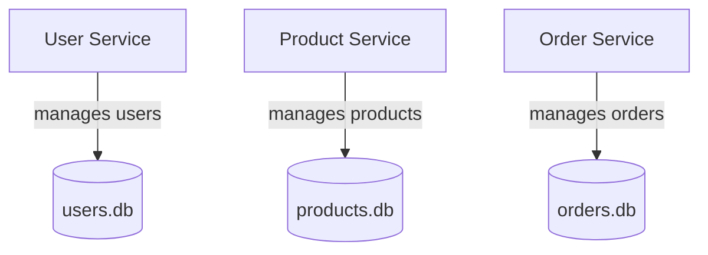

# 🧩 Microservices Demo (.NET + SQLite)

This project is a **learning-oriented microservices architecture** built with **ASP.NET Core Web API** and **Entity Framework Core (SQLite)**.  

The goal is to understand the basics of microservices step by step:  
- Independent services  
- Database per service  
- Communication between services  
- Resilience & containerization (later with Docker)

---

## 📚 What are Microservices?

- **Microservice** = a small, independent application that does *one thing well*.  
- Each service:  
  - Has its own codebase  
  - Runs independently  
  - Owns its own database  
  - Talks to others via APIs  

### Monolith vs Microservices

| Monolith 🏛 | Microservices 🧩 |
|-------------|-----------------|
| Single codebase, tightly coupled | Many small, independent services |
| One shared database | One database per service |
| Easy to start, harder to scale | More complex, but scalable & resilient |

---

## 🏗️ Services in this Project

We simulate a **mini e-commerce system** with 3 services:

- **User Service** → manages users (`users.db`)
- **Product Service** → manages products (`products.db`)
- **Order Service** → manages orders (`orders.db`), validates users and products

---

## 📂 Solution Structure

```
MicroservicesDemo.sln
├── UserService/          # Manages users
├── ProductService/       # Manages products
└── OrderService/         # Manages orders
```

Each service is:
- An **ASP.NET Core Web API**
- Uses **EF Core + SQLite**
- Has its own **database file**
- Runs on its own port

---

## ⚙️ Running the Services

Open a terminal for each service and run:

```bash
# User Service (http://localhost:5001)
cd UserService
dotnet run

# Product Service (http://localhost:5003)
cd ProductService
dotnet run

# Order Service (http://localhost:5005)
cd OrderService
dotnet run
```

---

## 🔎 Endpoints

### 👤 User Service
- `GET /api/users` → list users  
- `GET /api/users/{id}` → get user by ID  
- `POST /api/users` → create a user  

Example request:
```json
{ "name": "Alice", "email": "alice@example.com" }
```

---

### 📦 Product Service
- `GET /api/products` → list products  
- `GET /api/products/{id}` → get product by ID  
- `POST /api/products` → create a product  

Example request:
```json
{ "name": "Laptop", "price": 1200.00, "stock": 5 }
```

---

### 📝 Order Service
- `GET /api/orders/{id}` → get order by ID  
- `POST /api/orders` → create a new order  

Example request:
```json
{ "userId": "GUID", "productId": "GUID", "quantity": 2 }
```

⚠️ Currently, Order Service only stores **userId** and **productId**.  
In the next step, it will **call User & Product Services** to validate them before creating an order.

---

## 📊 Architecture (Step 1)



---

## 📌 Step 2: Service Communication (Next)

Next, we’ll make the **Order Service** communicate with others using **REST APIs**:

- ✅ Check user exists in User Service  
- ✅ Check product exists & stock is sufficient in Product Service  
- ✅ Add **resilience** with Polly (retry, circuit breaker)  

### Future Topics
- API Gateway (single entry point)  
- Async messaging (RabbitMQ / Kafka)  
- Docker & Docker Compose  
- Deployment to cloud  

---

## 🛠️ Development Notes

- **.gitignore** excludes build artifacts, local DBs, and IDE files.  
- Local databases (`*.db`) are not committed → each developer has their own local test data.  
- Each service is isolated → can be scaled, deployed, or rebuilt independently.  

---

## ✅ Quick Test Flow

1. **Create a user**  
   ```http
   POST http://localhost:5001/api/users
   Content-Type: application/json

   { "name": "Alice", "email": "alice@example.com" }
   ```

2. **Create a product**  
   ```http
   POST http://localhost:5003/api/products
   Content-Type: application/json

   { "name": "Laptop", "price": 1200.00, "stock": 5 }
   ```

3. **Create an order**  
   Use the `userId` and `productId` from the responses above:

   ```http
   POST http://localhost:5005/api/orders
   Content-Type: application/json

   { "userId": "GUID", "productId": "GUID", "quantity": 2 }
   ```

---

## 🎯 Learning Goals

By following this project, you’ll understand:
1. How to structure a microservices solution in .NET  
2. The “database per service” principle  
3. How services communicate via REST (and later async messaging)  
4. Containerization with Docker  
5. Basics of service discovery & API gateways  

---

👨‍💻 Author: *Learning Microservices step by step with AI*
